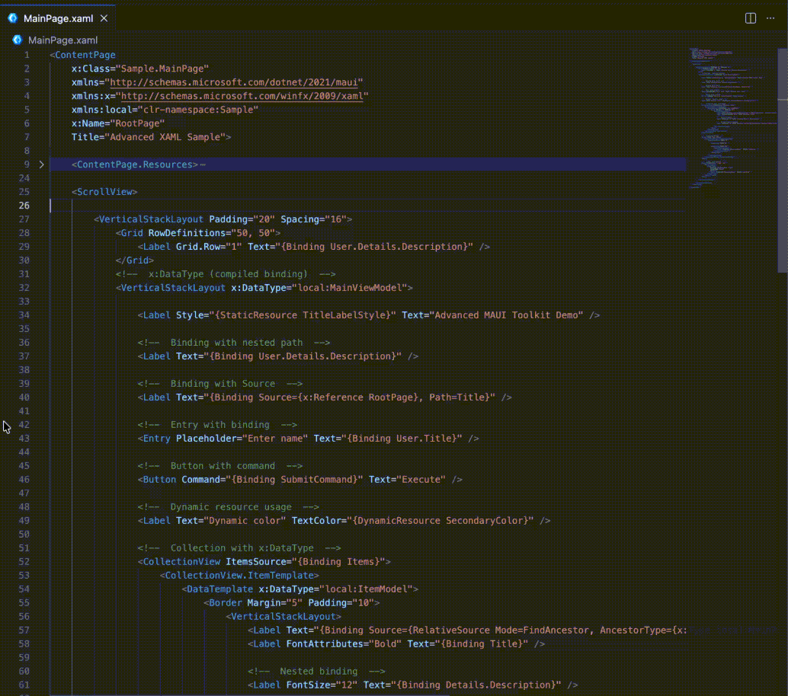
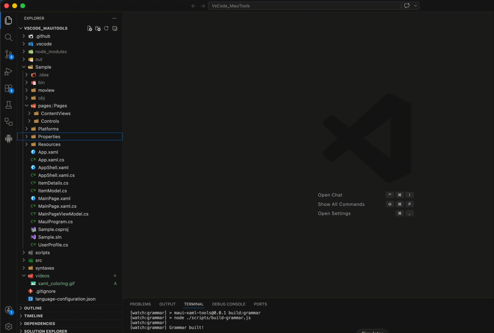

# MAUI Toolkit for VS Code


**MAUI Toolkit** is a set of tools designed to improve the development experience for .NET MAUI projects in Visual Studio Code.

It enhances the default tooling by adding:

* better XAML editing experience (coloring, readability)
* quick file generation via familiar **right-click context menus**
* productivity features inspired by full Visual Studio

---



## ✨ Features

* 🧱 Create MAUI components directly from Explorer

  * `ContentPage.xaml`
  * `ContentView.xaml`
* ⚡ Fast access via **right-click → MAUI Tools → Add**
* 🎨 Improved XAML readability (coloring & formatting)

---

## 🚀 Getting Started

1. Clone the repository
2. Install dependencies:

   ```bash
   npm install
   ```
3. Build the extension:

   ```bash
   npm run watch
   ```
4. Run the extension:

   * Press `F5` in VS Code

A sample MAUI project will open automatically for testing.

---

## 🗺️ Roadmap

* [x] Color XAML

* [x] Create basic `ContentPage` and `ContentView`

  * [x] XAML version
  * [ ] C# version

* [ ] Extract UI into reusable components
  *(e.g. select part of XAML → extract to ContentView + generate BindableProperties)*
* a lot more


---

## 🤝 Contributing

Feel free to open issues or suggest features

---

## 🛠️ Status

🚧 Early development — core features are being actively built.
